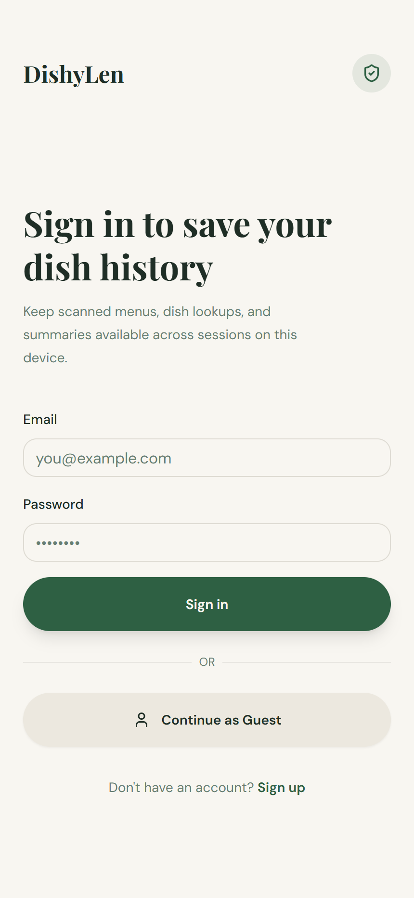
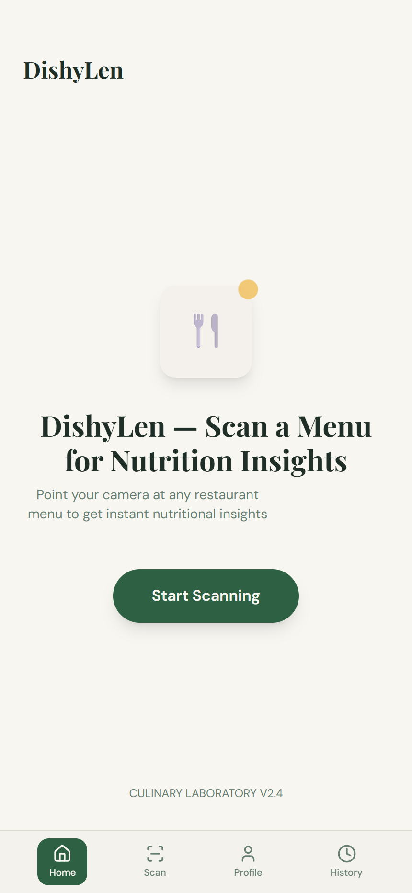
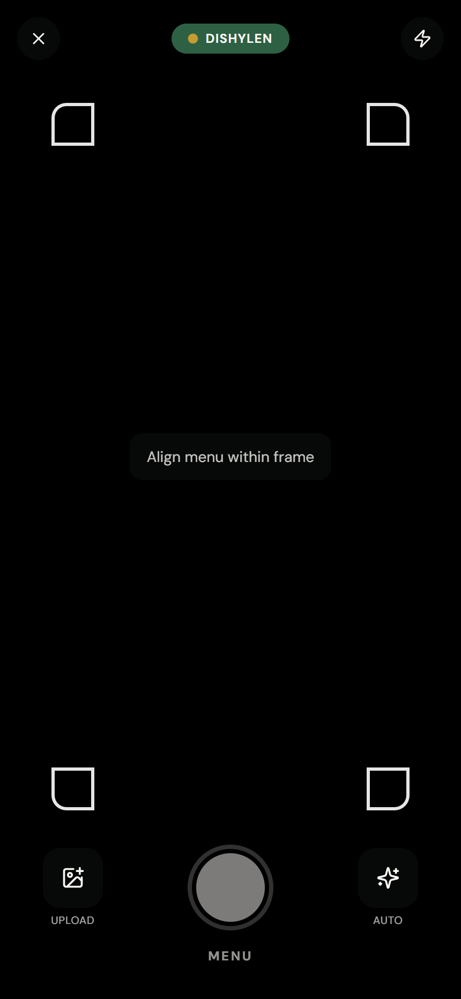
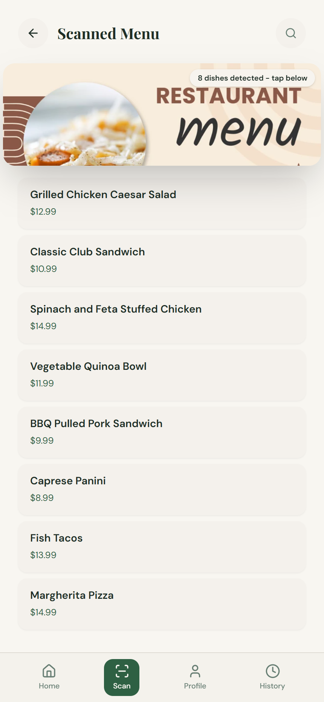
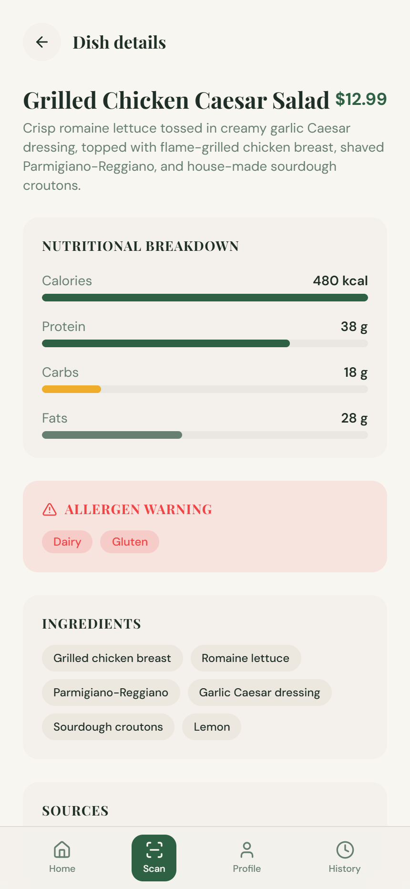
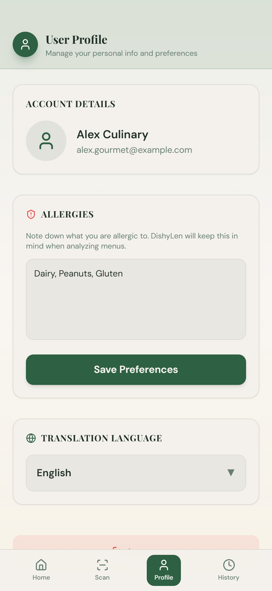
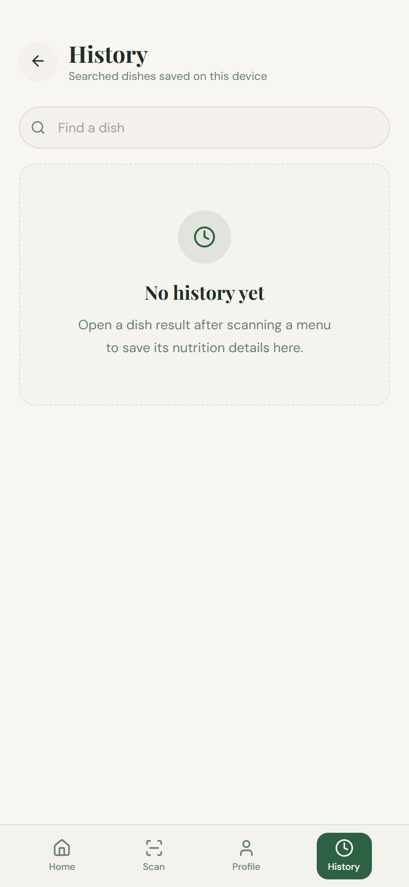
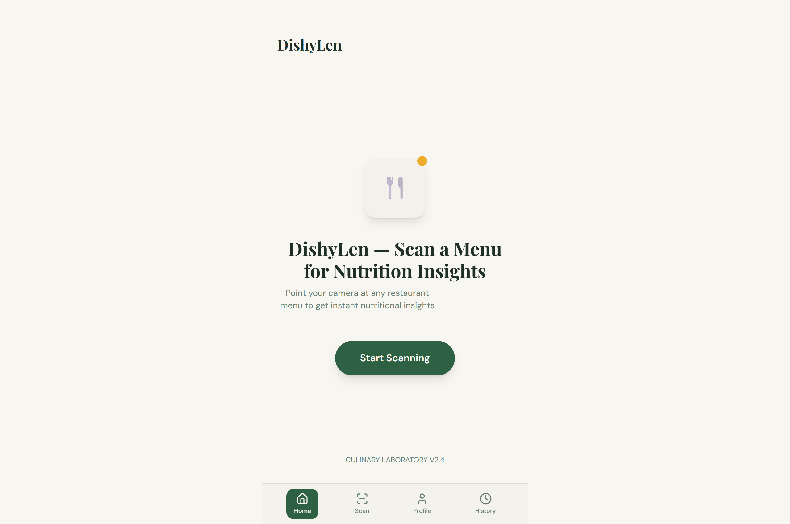

# 🥗 DishyLen Frontend — Client Application

<div align="center">

[](https://react.dev/)
[](https://www.typescriptlang.org/)
[](https://vitejs.dev/)
[](https://tailwindcss.com/)
[](https://capacitorjs.com/)

<p align="center">
  <strong>Cross-platform modern client application for DishyLen built with React 18, TypeScript, Tailwind CSS, shadcn/ui components, and Capacitor. Serves both as a responsive web app and as a native Android & iOS mobile application.</strong>
</p>

</div>

---

## 📱 Visual Showcase

<table align="center" width="100%">
  <tr>
    <td align="center" width="25%">
      
      <br /><strong>1. Authentication</strong>
    </td>
    <td align="center" width="25%">
      
      <br /><strong>2. Home Screen</strong>
    </td>
    <td align="center" width="25%">
      
      <br /><strong>3. Menu Scanner</strong>
    </td>
    <td align="center" width="25%">
      
      <br /><strong>4. Detected Items</strong>
    </td>
  </tr>
  <tr>
    <td align="center" width="25%">
      
      <br /><strong>5. Nutrition Deep-Dive</strong>
    </td>
    <td align="center" width="25%">
      
      <br /><strong>6. Allergies & Lang</strong>
    </td>
    <td align="center" width="25%">
      
      <br /><strong>7. History Record</strong>
    </td>
    <!-- <td align="center" width="25%">
      
      <br /><strong>8. Responsive UI</strong>
    </td> -->
  </tr>
</table>

---

## ✨ Features

- **Menu Camera & Scanner**: Take photos or upload menu images directly from your mobile camera or desktop file picker.
- **AI Menu Analysis**: View bounding boxes, OCR text recognition, and auto-corrected menu dish lists.
- **Nutritional Deep Dives**: Inspect calories, protein, carbohydrates, fats, ingredients, and allergen badges for any dish.
- **Personalized Allergen Alert System**: Automatic allergen matching against user preferences.
- **Multi-Language Support**: Seamless translation into Vietnamese, Spanish, Chinese, and English.
- **User Activity History**: Offline-first local storage synced with backend cloud history.
- **Google & Guest Authentication**: Flexible sign-in options across web and native mobile.

---

## 🏗️ Architecture & Component Hierarchy

```text
src/
├── components/
│   ├── AnalyzingScreen.tsx   # Progress animation during OCR analysis
│   ├── AssistantScreen.tsx   # AI dining chatbot assistant
│   ├── AuthGuard.tsx         # Route authentication wrapper
│   ├── BottomNav.tsx         # Mobile bottom navigation bar
│   ├── MenuItemDetail.tsx    # Dish modal with nutrition & allergen breakdown
│   ├── MenuResultsScreen.tsx # Extracted dish list and photo overlay
│   ├── ProfileScreen.tsx     # User profile, dietary preferences & allergies
│   ├── ScannerScreen.tsx     # Camera capture & file upload interface
│   ├── SplashScreen.tsx      # App launch splash animation
│   └── ui/                   # shadcn/ui atomic components (Button, Dialog, etc.)
├── hooks/                    # Custom React hooks (use-mobile, use-toast)
├── lib/
│   ├── dishyApi.ts           # REST API client connecting to FastAPI backend
│   └── utils.ts              # Tailwind styling helpers (clsx + tailwind-merge)
├── pages/                    # Top-level page routes (Index, Login, Register, History)
├── test/                     # Unit test files and Vitest setup
├── App.tsx                   # Main application router and QueryClient provider
├── index.css                 # Global CSS styles and Tailwind theme variables
└── main.tsx                  # React application DOM entry point
```

---

## 🚀 Getting Started

### 1. Environment Configuration

Ensure `.env` exists in `Frontend/`:

```dotenv
VITE_API_BASE_URL=http://localhost:8000
```

### 2. Installation

```bash
npm install
# or: bun install
```

### 3. Running Dev Server

```bash
# Start standard web dev server (http://localhost:5173)
npm run dev

# Or bind to 0.0.0.0 for LAN/mobile testing on your local network:
npm run dev:mobile
```

---

## 🛠️ Available Scripts

| Command | Description |
|---|---|
| `npm run dev` | Start local Vite development server on port 5173 |
| `npm run dev:mobile` | Start Vite server accessible across LAN |
| `npm run build` | Compile and bundle production assets to `dist/` |
| `npm run test` | Run unit tests via Vitest |
| `npm run lint` | Run ESLint across all source files |
| `npm run preview` | Locally preview the compiled production bundle |

---

## 📱 Mobile Development (Android via Capacitor)

```bash
# Sync Web Assets to Android
npm run build
npm run android:sync

# Open in Android Studio
npm run android
```


